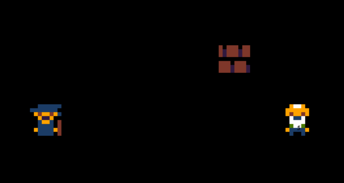
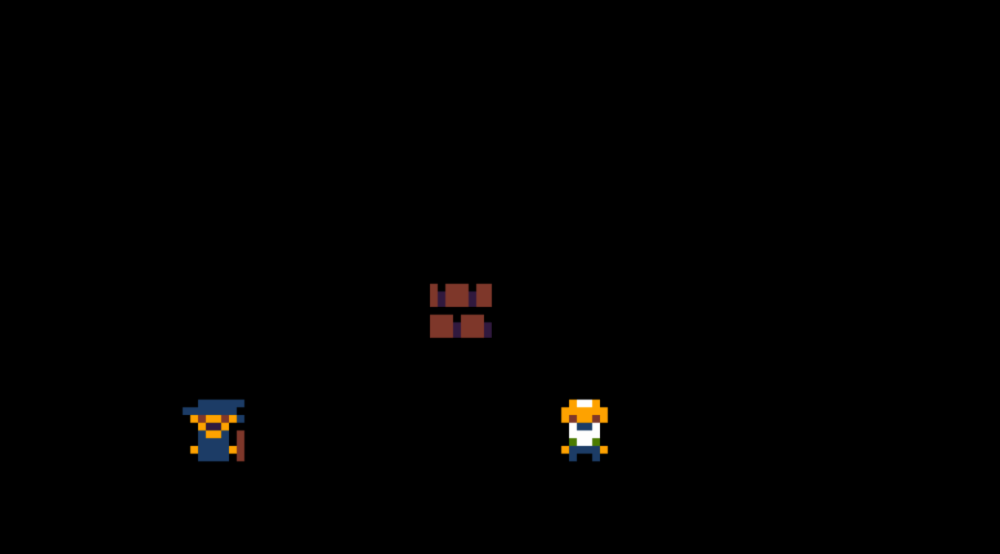
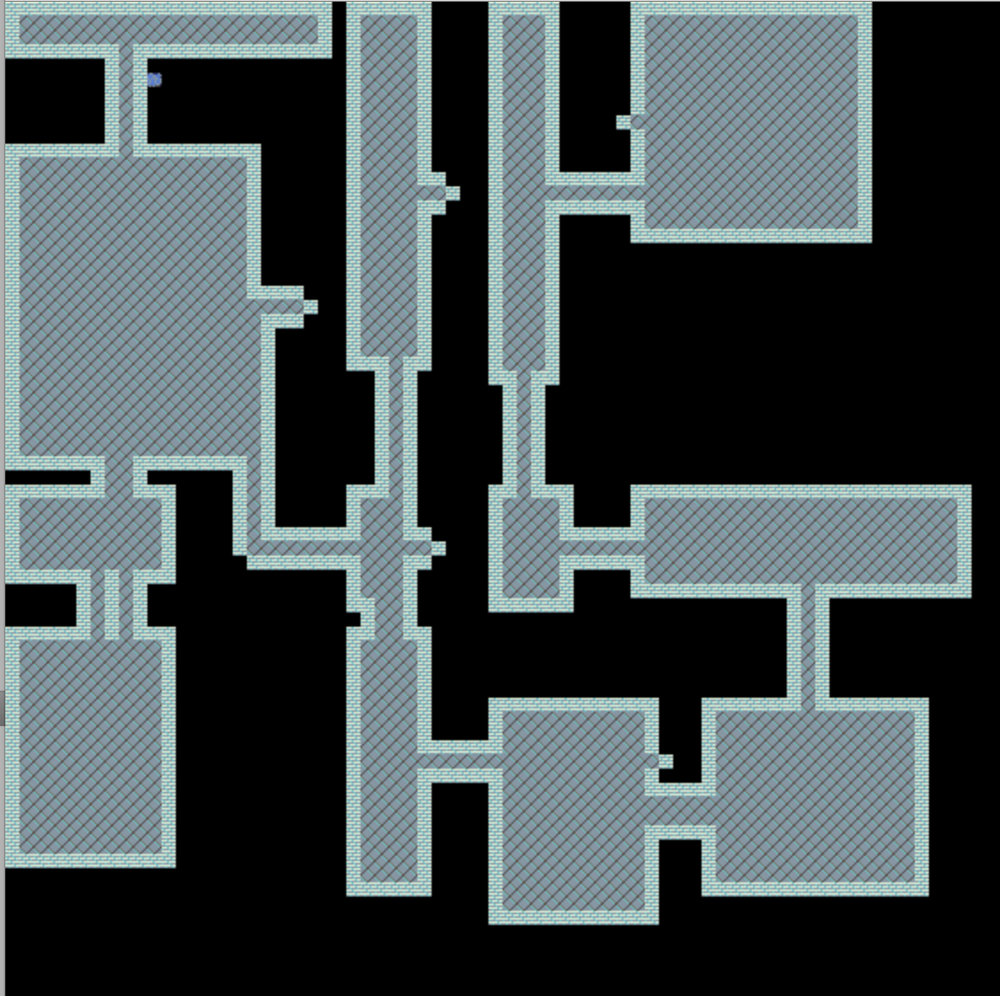
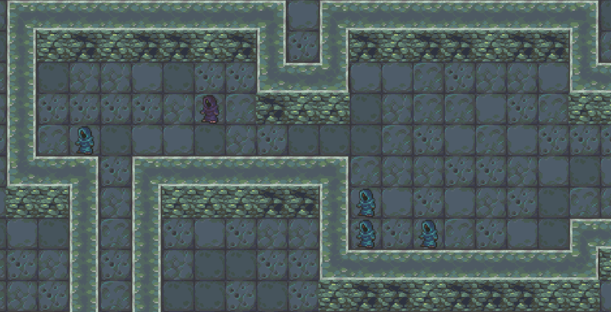
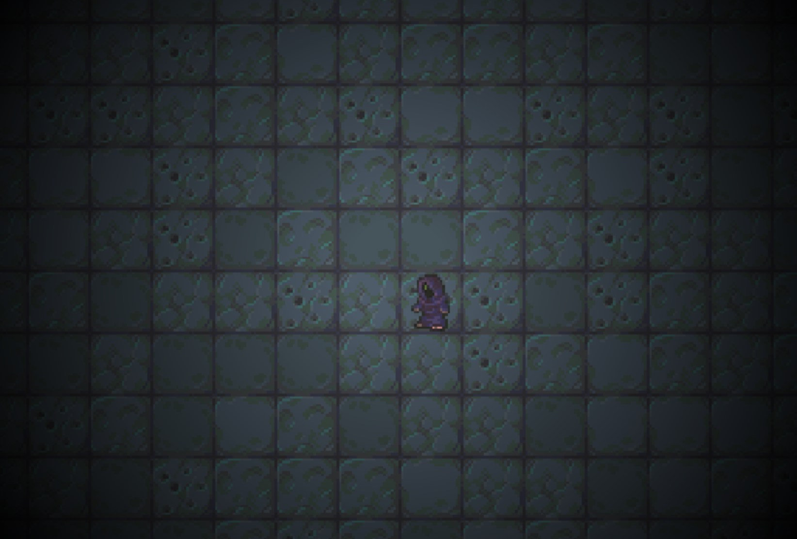

# Saturday, 02:20AM - 4-ish hours in

And we're off! 

So the goal is to create a game where the player plays a mage with two abilities - some kind of freeze/transport beam, and a trap. The gameplay will revolve around freezing enemies (one hit with the beam), switching places with them (when hitting a frozen target with the beam), and luring enemies into traps either by using the environment, or by switching places with them forcing them into a trap. There will be no HP, and no items.

I may have started a few hours early - realized the registration was open at 22:00 on Friday, and read the "you can start at any point during the weekend" so I went for it. Not sure if that was a gross misunderstanding or what. I'm just assuming that it's OK as long as I stay within a 168 hour window. Anyway. Got the initial skeleton up and running, with drawing, and movement more or less working. Also have the base for the freeze/transport skill up and running, along with collision detection. Drawing is very very slow right now, but I don't think I need to optimize apart from standard culling. There won't be more than 30-40ish enemies per. map, and maps won't be that large. If it turns out to be way too slow, or if I end up wanting larger maps, I'll consider breaking my personal "everything from scratch"-rule and steal some map chunking and visibility list code from one of my other projects.

Things are moving pretty fast, as I had a clear idea on both what I wanted to do in terms of the game design, as well as a pretty good idea on what the code should look like. My goal is to have the basic game running by the end of the weekend, leaving plenty of time for polish, play testing, and adding different stuff.

Next up is implementing traps. The progression will be to get as much of the gameplay running as possible, then move on to the dungeon generator. Last stage is a polish + feature creep phase. I'm considering adding a hunger clock w/food items, and some other minor things. We'll see. I *think* the basic freeze + teleport + trap mechanic may work by itself. If not, I have to look into adding some additional offensive skills.

Will be interesting to see how this turns out - I've only done 48 hour jams previously, so a week does seem like an awful lot of time right now. Then again - I won't be able to focus on this 100% when the week days creep in. 

But now - sleep.

# Saturday, 16:45

Spent a lot of time today fiddling with the drawing code. I had forgotten how tedious it is to do oldskool drawing by keeping track of dirty areas. #spoiledbyopengl. Considered switching to WebGL, but decided to stick with it. Seems stable now in any case. Until I add dialog probably.. Canvas is faster than it was when I last played with it too.

Got the freeze + teleport combo working properly at least - with aiming and everything. Next up is traps. But first, food!

# Saturday, 02:45

Oh boy. It's been a pretty long session. Did the traps in probably 10 minutes,have been doing the dungeon generator since. Probably spent 7-8 hours on it. It's far from perfect (and the code is pretty ugly), but it works well enough for now. Need to tweak it later. Went for a BSP-style algorithm. 

Turns out my drawing code is slow as hell too, need to implement culling, and some minor optimizations tomorrow. Also need to pre-calculate the tileset scaling - scaling on each draw call is super expensive.

Also experimented with a new tileset based on the DawnLike set. Mainly because I need a bunch of props. After looking at the empty generated maps, I started thinking about placing some props here and there. Pots, chairs, tables - that sort of thing. They may be a cool gameplay element too, I'm planning on making it possible to dot the switcharoo with them. 

But now, sleep. Again.

# Saturday, 15:30

It's been a productive early afternoon so far. Squeezed out a couple of hours, and managed to get a neighbor sensitive tile system up and running, sped up the dungeon generator by a magnitude, tweaked its output, and switched out the tileset again. I think this is the set I'll stick with, it looks pretty good.

Next up is a line-of-sight type thing. I'm thinking a fog of war type thing.
I think I'll just fill in the area outside of rooms/corridors as "not viewable", and the rest as "discoverable" during the generation. Then I'll do a limited flood fill based on the player position when it changes, to change "discoverable" to "viewable". Or something like that. 

# Saturday 18:20

A quick update this time - added fake lighting, blood splatter, and "center on player" camera.

Getting ready to add some mobs that actually attacks to make it playable.

